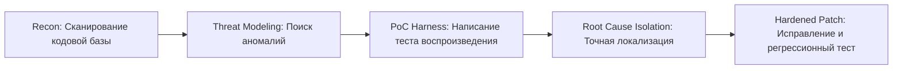

# 🛡️ Strix Core — Agentic Security & Vulnerability Testing

Навык **Strix Core** вооружает агента методологией автономного поиска уязвимостей, пентестинга и валидации безопасности в кодовой базе и системных компонентах (включая ядро, Ring 0/Ring 3 переходы, парсеры и IPC).

---

## 🎯 Ключевые направления анализа (Capabilities)

1. **Системный и низкоуровневый аудит (Memory Safety & Kernel ABI):**
   - **Stack / Heap Smashing:** проверка границ буферов, переполнения целых чисел, clobber регистров при переключениях контекста и системных вызовах (`isr64.S`, `sys_clone`, `futex`).
   - **Uninitialized Memory & Zeroing:** утечки данных из ядра в Ring 3 через структуры возврата (`siginfo_t`, `stat`, дескрипторы сокетов).
   - **Race Conditions & TOCTOU:** проверка атомарности файловых операций, блокировок (`mutex`, `rwlock`, `futex`) и маппингов (`mmap`, `MAP_FIXED`).

2. **Анализ криптографии и суверенитета (Crypto & Auth Audit):**
   - **Ed25519 & Сигнатуры:** аудит детерминизма подписей, проверка на replay-атаки, валидация публичных ключей.
   - **Квантово-семантический слой:** проверка инвариантности детерминистического поиска и предотвращение инъекций в RAG/индекс.

3. **Динамический фаззинг и валидация PoC (Proof-of-Concept):**
   - Автоматическая генерация минимальных воспроизводимых тестов (C/Zig) для подтверждения багов (как изоляция `tgsi-0xAAAA` через probe-тесты).
   - Верификация поведения без галлюцинаций: каждый найденный дефект подтверждается тестом.

---

## 🛠️ Рабочий процесс Strix Core (Workflow)

### Команды и паттерны вызова:
* **Аудит безопасности конкретного модуля:**
  Запустить анализ конкретной подсистемы на уязвимости и несоответствие ABI.
* **Генерация PoC стенда:**
  Создание автономного теста с изоляцией контекста для проверки гипотезы взлома или сбоя.
