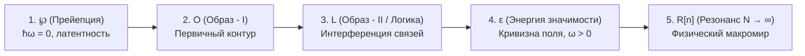
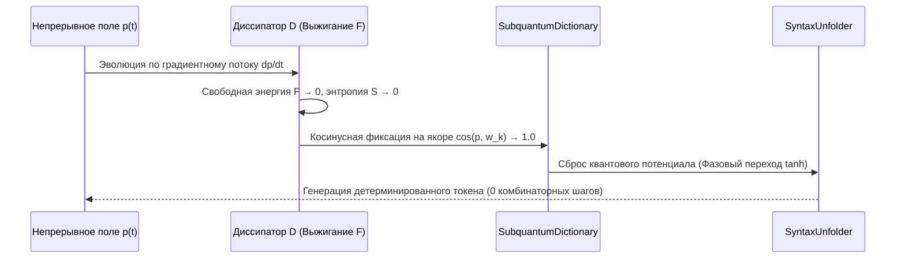

# ТОМ VI: КАУЗАЛЬНАЯ ДИНАМИКА, ПЯТИФАЗНЫЙ ЦИКЛ ℘–O–L–ε–R[n] И КВАНТОВО-СЕМАНТИЧЕСКИЙ ТОКЕНИЗАТОР PRISM

> **Архитектурный статус:** Канонический манифест фундаментальной теории информации, метакомпиляции и бессетевой токенизации ядра POLER[Ψ].  
> **Инвариант основания:** $\hbar\omega = 0 \iff H^\Psi = 0$ (глобальный баланс нулевого потенциала).  
> **Канонический оператор:** $\mathcal{A} = (\mathbb{O}, \oplus, \otimes_\varepsilon)$.

---

## 1. Фундаментальный баланс $\hbar\omega = 0$ и Архетипическая Дифференциация

### 1.1. Состояние глобальной стационарности ($H^\Psi = 0$)
В замкнутой Вселенной глобальная сумма всех причин и следствий тождественно равна нулю:
$$\hbar\omega = 0 \iff H^\Psi = 0.$$
Это состояние не является пустотой — это недетерминированная суперпозиция всех возможных архетипических конфигураций. Внешний наблюдатель отсутствует; Вселенная представляет собой самонаблюдаемую сеть, где каждый элемент $o_i \in \mathbb{O}$ одновременно выступает и субъектом (наблюдателем), и объектом (наблюдаемым).

### 1.2. Архетипы как идемпотентные проекторы
Переход от глобального нуля $\hbar\omega = 0$ к локально проявленным структурам осуществляется через операторы архетипов. Архетип $a \in \mathbb{O}$ удовлетворяет условию идемпотентности относительно деформированного произведения:
$$a \otimes_\varepsilon a = a.$$
* **Действие** проявляется как направленный фазовый импульс.
* **Бездействие** — как дуальный архетип покоя (статический баланс).
* **Сумма состояний** в замкнутом контуре сохраняет фундаментальный инвариант нуля: $\sum_k \omega_k = 0$.

---

## 2. Пятифазная шкала масштаба причинности: $\wp \to O \to L \to \varepsilon \to R[n]$

Развертывание причины в физическую и информационную реальность строго квантовано пятью последовательными фазами:

1. **Фаза ℘ (Прейепция / Pre-ception):**
   Точка абсолютного баланса $\hbar\omega = 0$. Латентное состояние причины до разделения на субъект и объект. Потенциал взаимодействия без выделения тактов времени.
2. **Фаза $O$ (Первичный Образ / Форма I):**
   Локальная флуктуация симметрии. Кристаллизация первичного топологического слепка. Формирование геометрической матрицы будущего взаимодействия.
3. **Фаза $L$ (Логический Образ / Форма II — Наложение):**
   Суперпозиция и интерференция архетипических форм. Формирование матрицы каузальных связей: разметка ролей «причина — следствие».
4. **Фаза $\varepsilon$ (Энергия Значимости):**
   Переход информации в динамику ($\omega > 0$). Вычисление метрической разности в римановом пространстве состояний:
   $$\varepsilon(o_i, o_j) = \kappa \cdot d_G(o_i, o_j)^2 = \kappa \, \Delta x^T G(p) \Delta x.$$
   Информационный образ обретает векторную массу (свободную энергию $F$).
5. **Фаза $R[n]$ (Резонанс $N \to \infty$):**
   Каскадное взаимодействие с окружающим ансамблем. Резонанс уплотняет энергию в стабильные физические и семантические аттракторы макромира.

---

## 3. Каноническое Уравнение Движения POLER[Ψ]

Динамическая эволюция любого информационного, физического или вычислительного процесса описывается единым каноническим дифференциальным уравнением:

$$\boxed{\frac{dp}{dt} = -\eta(t) \, \Pi_\Lambda \left[ D \cdot p + \gamma \, J(p) \cdot p + \nabla F(p) \right]}$$

### 3.1. Компоненты оператора:
1. **Проектор Каузальности МакВини ($\Pi_\Lambda$):**
   Идемпотентный масочный фильтр, очищающий пространство состояний от некаузального шума:
   $$\Pi_\Lambda = 3P^2 - 2P^3, \quad \Pi_\Lambda^2 = \Pi_\Lambda.$$
   Все ветви вычислений, нарушающие инвариант каузальности, мгновенно умножаются на ноль ($\Pi_\Lambda \cdot p_{\text{invalid}} = 0$).
2. **Оператор Термодинамической Диссипации ($D$):**
   Матрица диссипативного трения $D = L \cdot L^T \ge 0$, выжигающая энтропийный шум $S \to 0$ и принудительно направляющая фазовый вектор к минимуму свободной энергии ($F \to 0$).
3. **Кососимметричный Оператор Унитарного Вращения ($J(p)$):**
   Матрица чистого фазового вращения $J(p) = A(p) - A(p)^T = -J(p)^T$, сохраняющая инвариант нормы состояния:
   $$\langle p, J(p) p \rangle_G \equiv 0 \implies \frac{d}{dt} \|p_t\|_G^2 = 0.$$
4. **Адаптивный Масштаб Времени ($\eta(t)$):**
   $$\eta(t) = \eta_0 \exp\left(-\beta_\sigma \Sigma(t)\right),$$
   где $\Sigma(t)$ — топологическая кривизна семантического поля. В точках экстремального градиента время замедляется, гарантируя численную устойчивость без расходимости.

---

## 4. Замена BPE-Токенизации Фазовым Переходом (`SyntaxUnfolder`)

Классическая токенизация (Byte-Pair Encoding, BPE) разбивает непрерывный семантический поток на дискретные слепые фрагменты, разрушая квантовую когерентность контекста. В POLER[Ψ] токенизация реализована как **нелинейный термодинамический фазовый переход**:

1. **Непрерывное удержание:** Система оперирует в непрерывном фазовом пространстве до тех пор, пока свободная энергия $F$ не опустится ниже порога конденсации.
2. **Косинусный коллапс в аттрактор:** За счет диссипации $D$ вектор $p_t$ детерминированно прижимается к ближайшему семантическому якорю в `SubquantumDictionary`.
3. **SyntaxUnfolder:** При достижении критической точки происходит бессетевой сброс энергии в готовый токен/инструкцию. Исключается необходимость в Softmax по 100k словарям и вероятностном Beam Search.

---

## 5. Трехшаговый Алгоритм Поглощения «Prism»

Любая сторонняя система (код на C/Fortran, квантово-химический интеграл, сетевой протокол) ассимилируется метакомпилятором POLER по трехшаговому канону:

* **Шаг 1 (Сенсорный перехват — Фаза ℘):**  
  Сторонняя программа лишается алгоритмической свободы и низводится до пассивного поставщика сырых матриц/тензоров $o_t$ (например, интегралы Хартри — Фока $S, h_{\text{core}}, \text{eri}$).
* **Шаг 2 (Алгебраическое построение Проектора $\Pi_\Lambda$):**  
  Все граничные условия и законы сохранения сторонней задачи упаковываются в Якобиан ограничений $J_c$ и идемпотентный проектор $\Pi_\Lambda$.
* **Шаг 3 (Запуск канонического градиентного потока):**  
  Громоздкие циклы и ветвления стороннего алгоритма замещаются каноническим уравнением $\frac{dp}{dt} = -\eta \Pi_\Lambda [D p + \gamma J p + \nabla F]$, которое кратчайшим геодезическим путем скатывает систему в стационарную точку $H^\Psi = 0$.

---

## 6. Аппаратное Заземление в Регистры Процессора (SIMD / FPGA)

1. **Диагонально-блочный тензор $G(p)$:**  
   Метрика Римана факторизована в локальные $4 \times 4$ и $8 \times 8$ блоки, полностью помещающиеся в регистры **AVX2 / AVX-512 (YMM / ZMM)** или блочную память FPGA (BRAM).
2. **Zero-Copy FMA Contraction:**  
   Свободная энергия $F = \frac{1}{2} \Delta x^T G(p) \Delta x$ и градиент $\nabla F$ вычисляются за 1 такт ALU с помощью инструкций `_mm512_fmadd_ps` без обращений к шине RAM.
3. **Кососимметрия $J(p)$ за 0 тактов памяти:**  
   Оператор $J(p) \cdot p = (A - A^T) p$ выполняется через перестановки `_mm512_permute_ps` и побитовое инвертирование знака (`_mm512_xor_ps`), устраняя задержки фон Неймана.
